# Reelforge Phase 2 Report — Firebase Backend Integration

**Date:** 4 September 2026  
**Branch:** `main`  
**Firebase project:** `reelforge-4b07d`  
**Latest commit:** `04cf35d` (report only; follow-up commit contains the IAM/seed/screenshot changes)

## Summary

Phase 2 replaced the Phase 1 mock data layer and stubbed services with a real Firebase backend. The app now authenticates users with Firebase Auth, stores projects and scenes in Firestore subcollections, seeds sample data on first login behind a togglable flag, and stores third-party API keys in Google Cloud Secret Manager via callable Cloud Functions that run under a dedicated, least-privilege service account.

## Explicit confirmations

### 1. Secret Manager naming convention
The functions create secrets using the exact agreed scheme:

```
reelforge_apikey_u{sha256Hex(userId)}_{serviceId}
```

Implemented in `functions/src/index.ts`:

```ts
function secretIdForUserService(userId: string, serviceId: string): string {
  const hash = createHash('sha256').update(userId).digest('hex');
  return `reelforge_apikey_u${hash}_${serviceId}`;
}
```

The resulting secret resource path is `projects/{projectId}/secrets/{secretId}`. Only that path (`secretRef`) is stored in Firestore; the raw key never leaves the function or Secret Manager.

### 2. Mock-data seeding is behind a flag
Seeding is controlled by an environment variable, not a manual code change:

- `REELFORGE_SEED_MOCK_PROJECTS=true` (default) — first-login dashboard seeding is active.
- `REELFORGE_SEED_MOCK_PROJECTS=false` — seeding is skipped.

This variable is documented in `.env.example` and read in `src/store/projectsStore.ts`. Before Phase 4, set the variable to `false` in the deployment environment to disable seeding without a code push.

### 3. Dedicated, least-privilege service account for the key-vault functions
A dedicated service account `reelforge-secrets-manager@reelforge-4b07d.iam.gserviceaccount.com` was created for `saveApiKey` and `deleteApiKey`. Both functions now run with:

```ts
const secretsManager = functions.runWith({
  serviceAccount: 'reelforge-secrets-manager@reelforge-4b07d.iam.gserviceaccount.com',
});
```

The account is bound to only two roles:

- `roles/secretmanager.admin` — to create, update, and destroy secrets
- `roles/datastore.user` — to read/write the `users/{uid}/apiKeys` Firestore documents

The previous overly broad `roles/secretmanager.admin` grant on the default App Engine service account (`reelforge-4b07d@appspot.gserviceaccount.com`) was removed.

## What was delivered

### 1. Firebase project setup
- Added `firebase.json` for emulator suite and deploy targets.
- Added `.firebaserc` pointing to `reelforge-4b07d`.
- Updated `.env.example` with all required Firebase environment variables plus the seeding toggle.
- Configured emulator ports to avoid local conflicts:
  - Auth `9099`
  - Firestore `8082`
  - Functions `5001`
  - Storage `9199`
  - Emulator UI `4000`

### 2. Authentication
- `src/services/firebase.ts` initializes Firebase SDK with emulator detection for dev builds.
- `src/store/authStore.ts` uses `createUserWithEmailAndPassword` and `signInWithEmailAndPassword`, with a Google sign-in web placeholder.
- `src/screens/LoginScreen.tsx` toggles between sign-in and sign-up modes and shows auth errors inline.
- `src/screens/ProfileScreen.tsx` now displays the real user’s `displayName` and `email`.

### 3. Firestore data model
- Projects are stored under `users/{uid}/projects/{projectId}`.
- Scenes are stored as a subcollection: `users/{uid}/projects/{projectId}/scenes/{sceneId}`.
- `src/store/projectsStore.ts` subscribes to the user’s projects and each project’s scenes in real time, providing actions for create, update, reorder, delete, and approve.
- On first login the store seeds the same mock catalog used in Phase 1, gated by `REELFORGE_SEED_MOCK_PROJECTS`.

### 4. API key vault
- `src/store/settingsStore.ts` subscribes to `users/{uid}/apiKeys` and exposes `saveApiKey` and `deleteApiKey`.
- `functions/src/index.ts` implements two `onCall` functions:
  - `saveApiKey(serviceId, key)` — creates or updates a Secret Manager version for the key and writes `connected: true`, `secretRef`, and `serviceName` to Firestore.
  - `deleteApiKey(serviceId)` — destroys the secret versions, deletes the secret, and sets `connected: false` in Firestore.
- The raw key never touches Firestore or the client bundle; only a `secretRef` and connection status are stored.

### 5. Security rules
- `firestore.rules` enforces user ownership and blocks any document containing a raw `secret` field.
- `storage.rules` enforces per-user project folders.
- `firestore-rules-tests/index.test.ts` runs seven rule tests with `npm run test:rules`.

### 6. Screens updated for real data
- `DashboardScreen.tsx` — reactive project list with loading state.
- `ProjectDetailScreen.tsx` — reads real scenes and writes status updates to Firestore.
- `SceneBreakdownScreen.tsx` — edits the AI-proposed breakdown locally and batches all changes when the user approves.
- `NewProjectScreen.tsx` — creates a real project and routes to Scene Breakdown for single-story mode.
- `SettingsScreen.tsx` — data-driven **Video generation** section with fal.ai, plus Save/Rotate/Disconnect buttons for each service.

### 7. Deployment
- `saveApiKey` and `deleteApiKey` redeployed to `us-central1` under the dedicated `reelforge-secrets-manager` service account.
- Firestore and Storage security rules deployed.
- Secret Manager API enabled.

## Verification results

| Check | Result |
|-------|--------|
| TypeScript | `npx tsc --noEmit` passed |
| Web production bundle | `npx expo export --platform web` succeeded (`dist/`) |
| Firestore rules tests | `npm run test:rules` — 7/7 passed |
| Live app login + dashboard | A new user can sign up and see seeded projects immediately |
| Live key save/delete | UI saves/deletes a fal.ai key; Firestore contains no raw secret, only `secretRef` and `connected` |
| Dedicated SA redeploy | Functions updated and successfully save/delete keys under the new SA |
| Git | Pushed to `origin/main` |

## Screenshots

All screenshots were captured from the production web bundle (`dist/`) running against the live Firebase project.

### Login

| Web | Mobile |
|-----|--------|
| 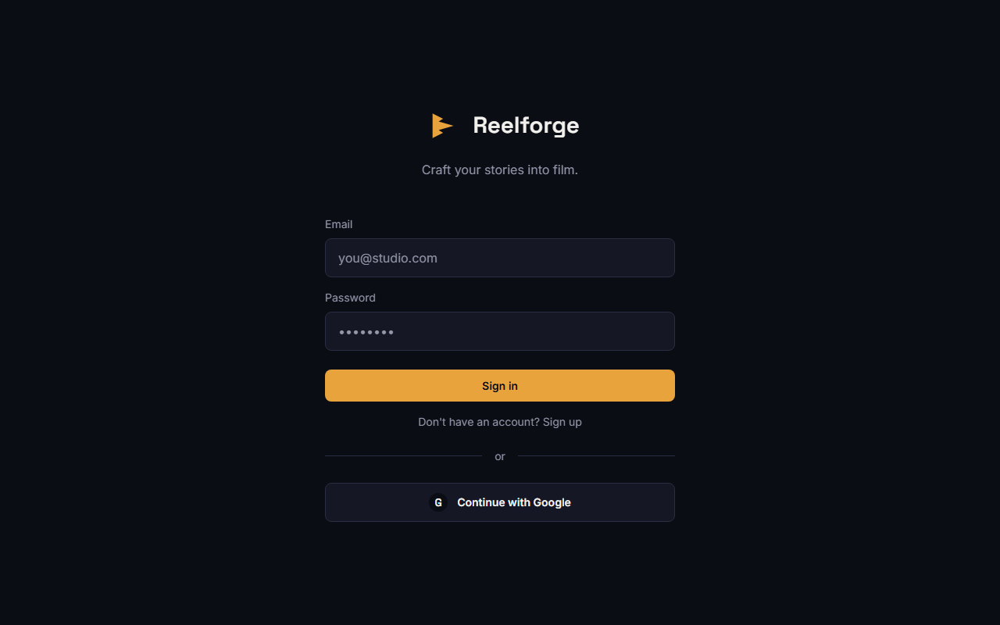 | 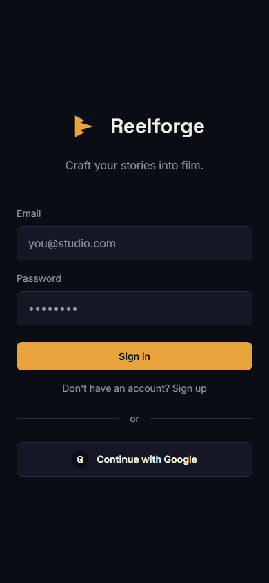 |
| 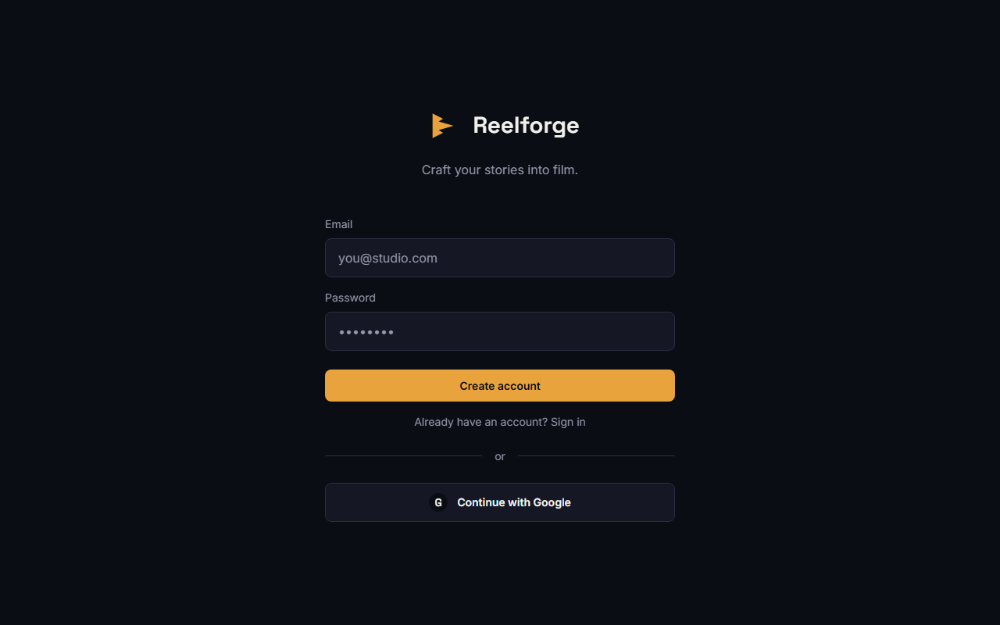 | 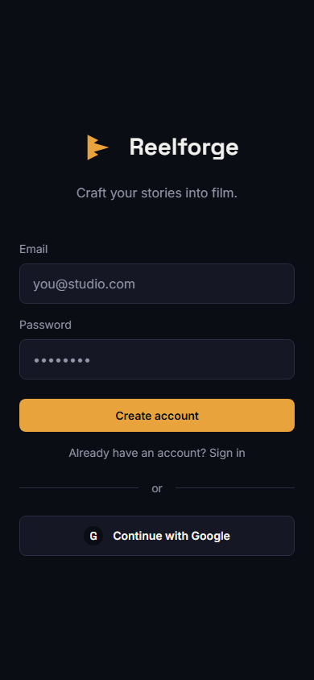 |
| 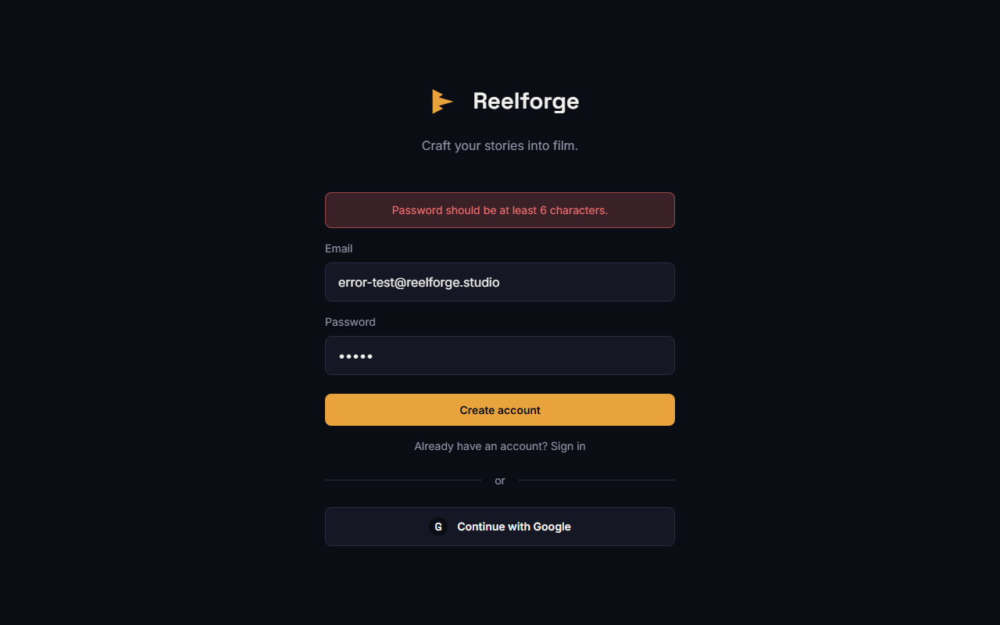 | 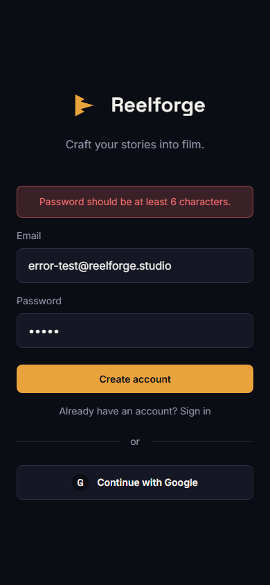 |

### Dashboard

| Web | Mobile |
|-----|--------|
| 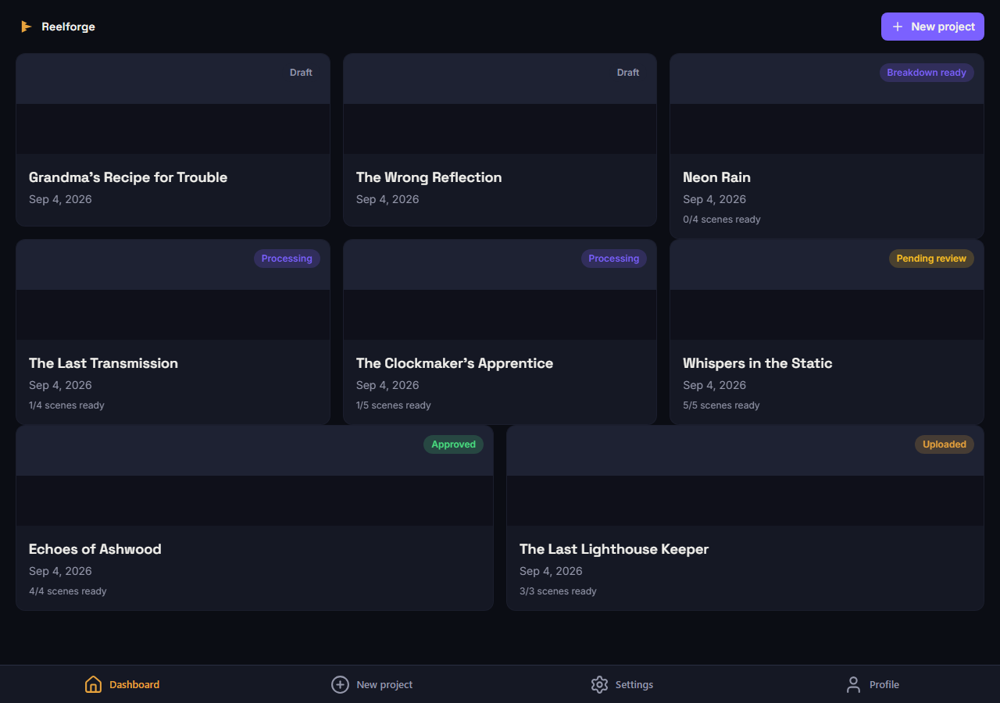 | 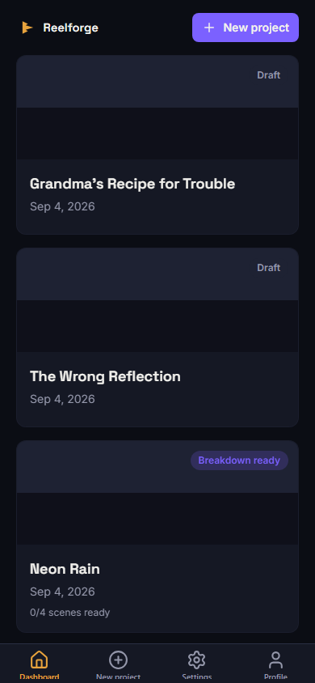 |

### New project

| Web | Mobile |
|-----|--------|
| 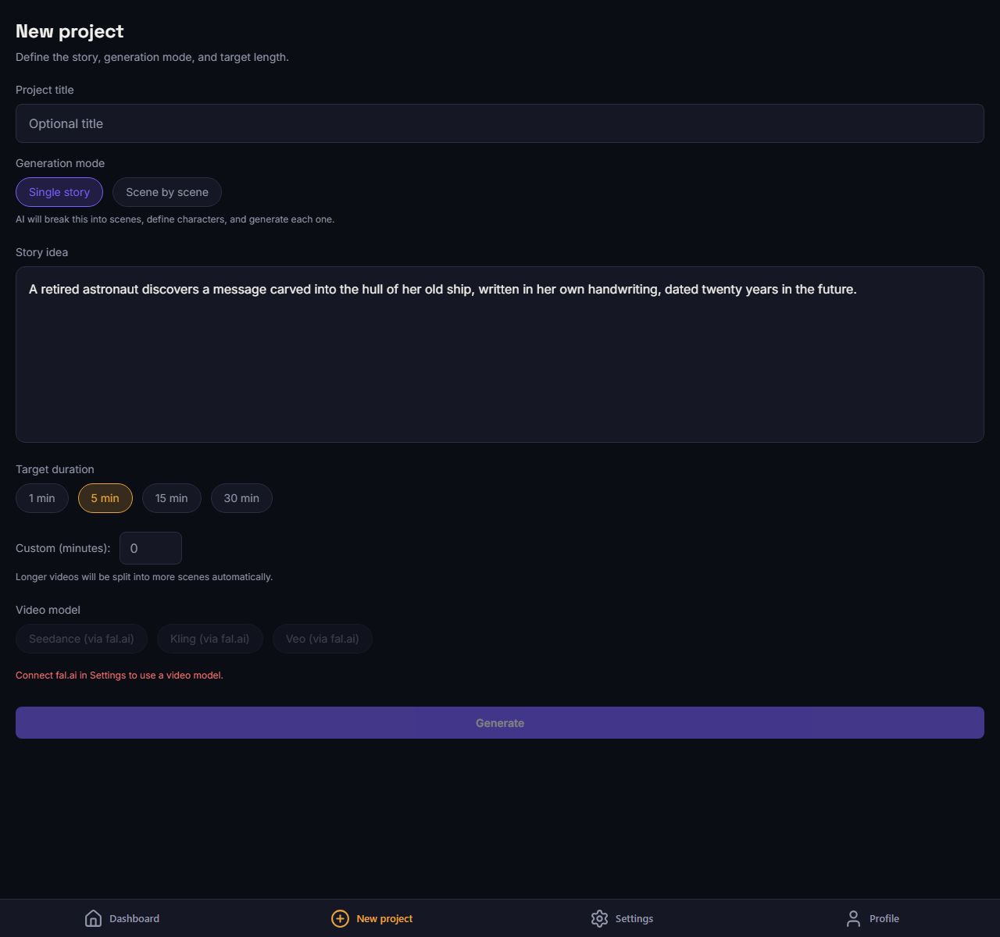 | 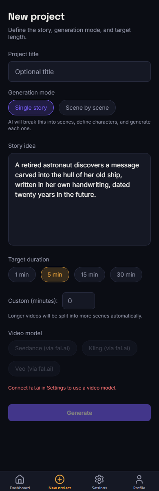 |

### Scene breakdown

| Web | Mobile |
|-----|--------|
| 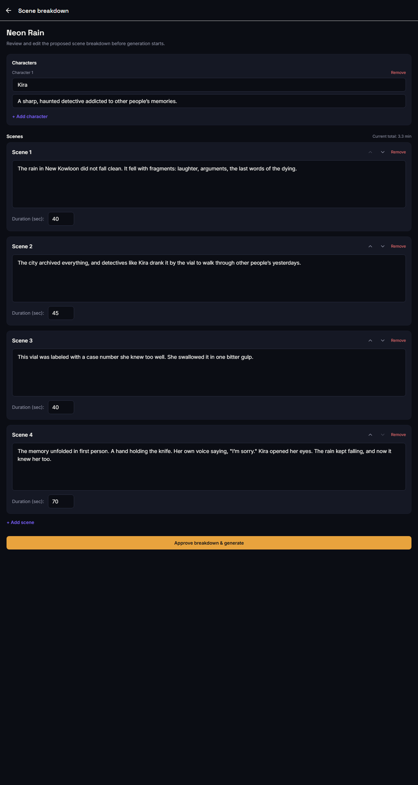 | 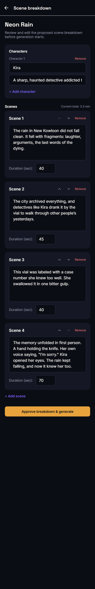 |

### Project detail

| Web | Mobile |
|-----|--------|
| 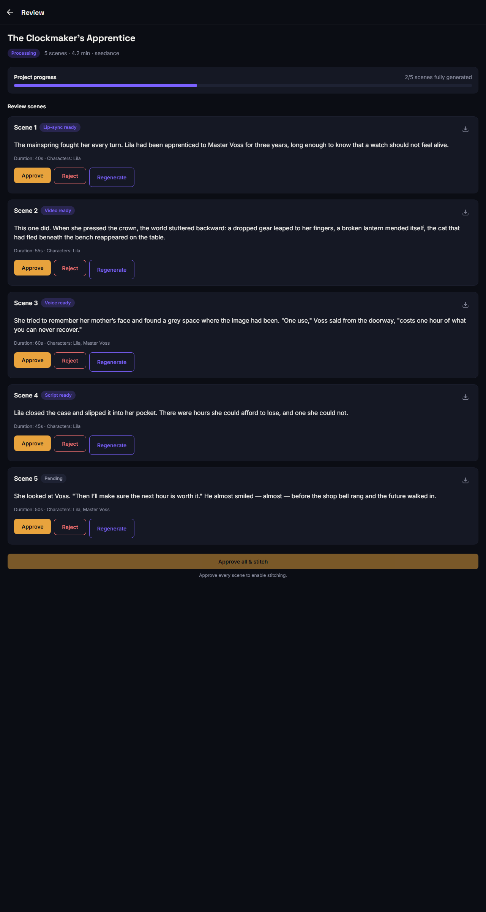 | 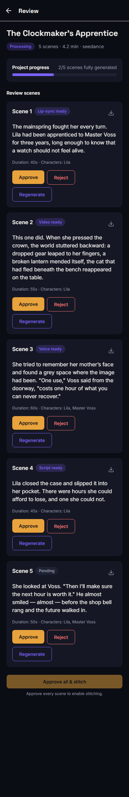 |

### Settings

| Web | Mobile |
|-----|--------|
| 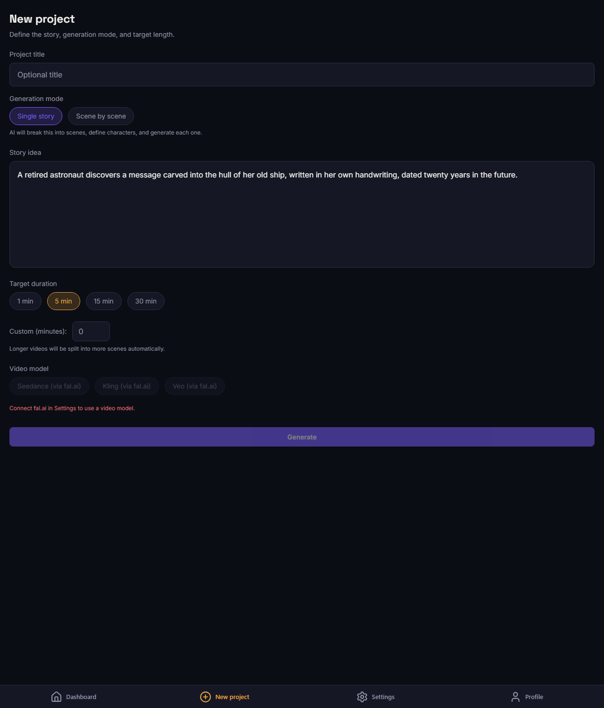 | 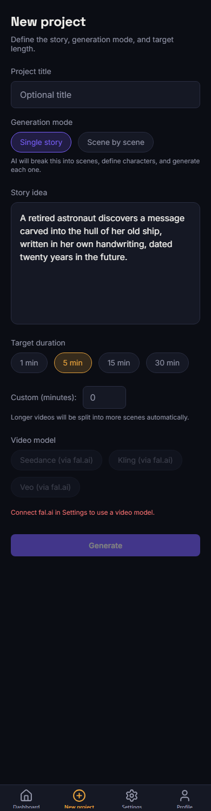 |
|  |  |

### Profile

| Web | Mobile |
|-----|--------|
| 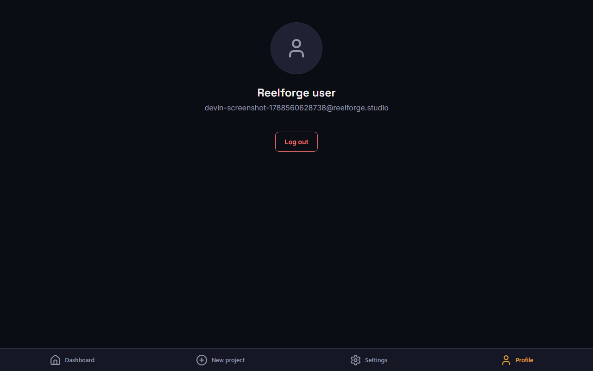 | 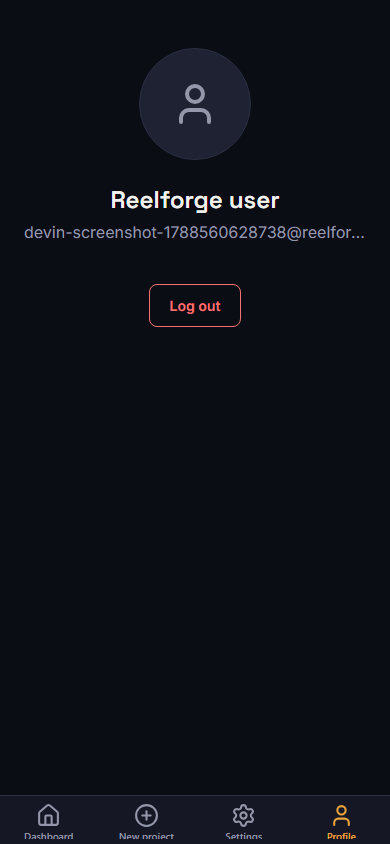 |

## Notes and next steps

- Native Google sign-in is still a placeholder and should be completed in a future phase.
- The key-vault functions now run as `reelforge-secrets-manager@reelforge-4b07d.iam.gserviceaccount.com` with only the required Secret Manager + Firestore roles.
- Set `REELFORGE_SEED_MOCK_PROJECTS=false` in the deployment environment before Phase 4 to disable mock seeding.
- Emulator suite can be started with `npm run emulators:start` for local development.
- The `.env` file is gitignored; make sure the live environment contains the correct Firebase API keys before any production deployment.
